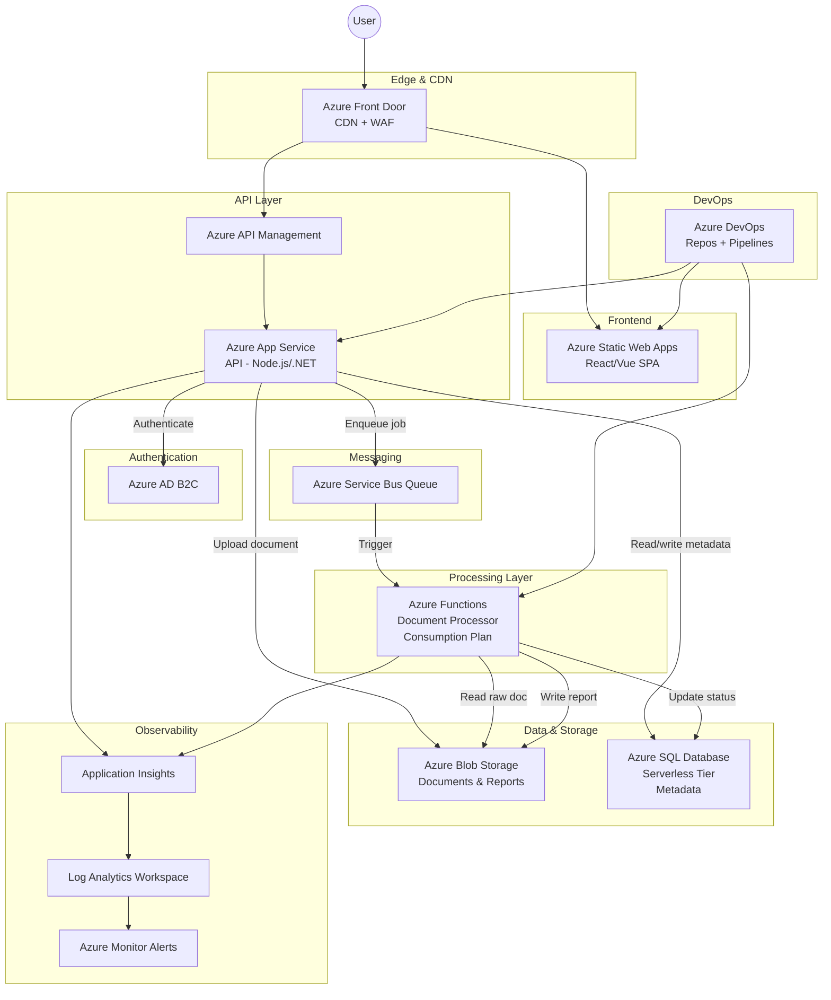

# Modernizing a Monolithic Document Processing Application on Azure

## 1. Problem Summary

A company runs a monolithic web application on a single VM that allows customers to upload documents and view generated reports. The system suffers from downtime during traffic spikes, tightly coupled document processing that degrades user experience, no auto-scaling, limited observability, manual deployments, and a single point of failure.

The goal is to design a **cloud-native architecture on Microsoft Azure** that decouples processing, scales elastically, and can be easily operated by a small engineering team using **Azure DevOps for source control and CI/CD automation**.

---

# 2. Functional Requirements

* Users can upload documents through a web dashboard
* Uploaded documents are processed asynchronously (decoupled from the upload request)
* Processed results (reports) are stored and made available to users
* Users can download processed reports through the dashboard

---

# 3. Non-Functional Requirements

| Requirement          | Target                                                                        |
| -------------------- | ----------------------------------------------------------------------------- |
| **Availability**     | ~99.9% (leveraging Azure SLA-backed services)                                 |
| **Scalability**      | Handle thousands of uploads per hour with auto-scaling                        |
| **Security**         | Encryption at rest and in transit, least-privilege access, managed identities |
| **Async Processing** | Document workloads processed via queue-driven workers                         |
| **Cost Efficiency**  | Consumption-based pricing where possible; avoid over-provisioning             |
| **Observability**    | Centralized logging, monitoring dashboards, and alerting                      |

---

# 4. Proposed Architecture

## Architecture Diagram

---

# 5. Component Breakdown

| Component            | Azure Service                        | Purpose                                                                                       |
| -------------------- | ------------------------------------ | --------------------------------------------------------------------------------------------- |
| **Frontend**         | Azure Static Web Apps                | Hosts the SPA dashboard with global distribution and integrated CI/CD through Azure Pipelines |
| **CDN / Edge**       | Azure Front Door                     | Global load balancing, CDN caching for static assets, and Web Application Firewall (WAF)      |
| **API Layer**        | Azure App Service + API Management   | REST API for uploads, metadata, and report retrieval                                          |
| **Authentication**   | Azure AD B2C                         | Managed identity provider for customer authentication                                         |
| **Messaging**        | Azure Service Bus                    | Reliable queue for decoupling uploads from processing                                         |
| **Processing**       | Azure Functions                      | Event-driven document processing triggered by queue messages                                  |
| **Document Storage** | Azure Blob Storage                   | Stores raw documents and generated reports                                                    |
| **Metadata Store**   | Azure SQL Database (Serverless)      | Stores document metadata and processing status                                                |
| **Observability**    | Application Insights + Log Analytics | Monitoring, logging, and alerting                                                             |
| **CI/CD Platform**   | Azure DevOps                         | Source control, pipeline automation, and infrastructure deployment                            |

---

# 6. Data Flow

## Upload Flow

1. User authenticates via **Azure AD B2C**
2. User uploads a document through the **SPA**
3. The **API (App Service)** validates the request
4. The API uploads the document to **Azure Blob Storage**
5. Metadata is stored in **Azure SQL**
6. The API publishes a message to **Azure Service Bus**
7. The API returns a **202 Accepted response with a tracking ID**

---

## Processing Flow

1. **Azure Functions** is triggered by a Service Bus message
2. The function downloads the document from **Blob Storage**
3. The function processes the document and generates a report
4. The report is saved back to **Blob Storage**
5. The metadata record in **Azure SQL** is updated
6. Failures are routed to a **dead-letter queue**

---

## Report Retrieval Flow

1. The dashboard calls the API to retrieve document metadata
2. The API queries **Azure SQL**
3. For completed reports, the API generates a **SAS URL**
4. The user downloads the report directly from **Blob Storage**

---

# 7. Scalability Approach

* **Frontend:** Static Web Apps + Front Door CDN automatically scale globally
* **API Layer:** Azure App Service auto-scales based on CPU or request metrics
* **Processing Layer:** Azure Functions scales automatically based on queue depth
* **Database:** Azure SQL Serverless scales compute automatically
* **Storage:** Azure Blob Storage scales virtually without limits
* **Queue:** Azure Service Bus supports high-throughput messaging

This architecture allows **upload traffic and processing workloads to scale independently**, preventing processing spikes from degrading user experience.

---

# 8. Security Considerations

| Area                  | Approach                                                 |
| --------------------- | -------------------------------------------------------- |
| Authentication        | Azure AD B2C using OAuth 2.0                             |
| Authorization         | API enforces per-user access control                     |
| Encryption at rest    | Blob Storage and Azure SQL encrypted by default          |
| Encryption in transit | TLS 1.2+ across all endpoints                            |
| Secrets               | Azure Key Vault for secret management                    |
| Identity              | Managed identities for service-to-service authentication |
| Network Security      | WAF on Front Door + private endpoints                    |

---

# 9. Operational Considerations

## CI/CD with Azure DevOps

Source code is stored in **Azure DevOps Repos** and deployed using **Azure Pipelines**.

### Frontend Pipeline

* Trigger: commit or pull request to `main`
* Steps:

  * Install dependencies
  * Build the SPA
  * Run unit tests
  * Deploy to **Azure Static Web Apps**

### API Pipeline

* Build and test the API
* Package application artifacts
* Deploy to **Azure App Service**
* Use **deployment slots** for blue-green deployments

### Azure Functions Pipeline

* Build the function application
* Run tests
* Deploy to **Azure Functions** using Azure Pipelines tasks

### Infrastructure Pipeline

Infrastructure is defined using **Bicep templates** stored in a `/infra` directory.

Azure Pipelines deploys infrastructure using:

* `az deployment group create`
* environment-based configurations (`dev`, `staging`, `prod`)

This ensures **repeatable infrastructure provisioning using Infrastructure as Code (IaC).**

---

# 10. Monitoring and Alerting

Monitoring is implemented using:

* **Application Insights** for application telemetry
* **Log Analytics Workspace** for centralized log querying
* **Azure Monitor Alerts**

Example alerts:

| Alert              | Trigger                     |
| ------------------ | --------------------------- |
| API error rate     | >5%                         |
| Function failures  | Dead-letter queue growth    |
| SQL load           | >80% utilization            |
| Storage throttling | Capacity threshold exceeded |

---

# 11. Deployment Strategy

* **Azure DevOps multi-stage pipelines**
* **Deployment slots** for App Service
* **Automated post-deployment health checks**
* **Feature flags for progressive rollout**

This enables **safe, repeatable, and zero-downtime deployments**.

---

# 12. Trade-offs and Alternatives

| Alternative    | Reason Not Chosen                                                |
| -------------- | ---------------------------------------------------------------- |
| AKS            | Adds operational overhead for a small team                       |
| Container Apps | Slightly more complex than Functions for simple queue processing |
| Cosmos DB      | Higher cost and complexity for relational metadata               |
| Storage Queues | Lacks advanced messaging features                                |
| VM Scale Sets  | Maintains monolithic infrastructure patterns                     |
