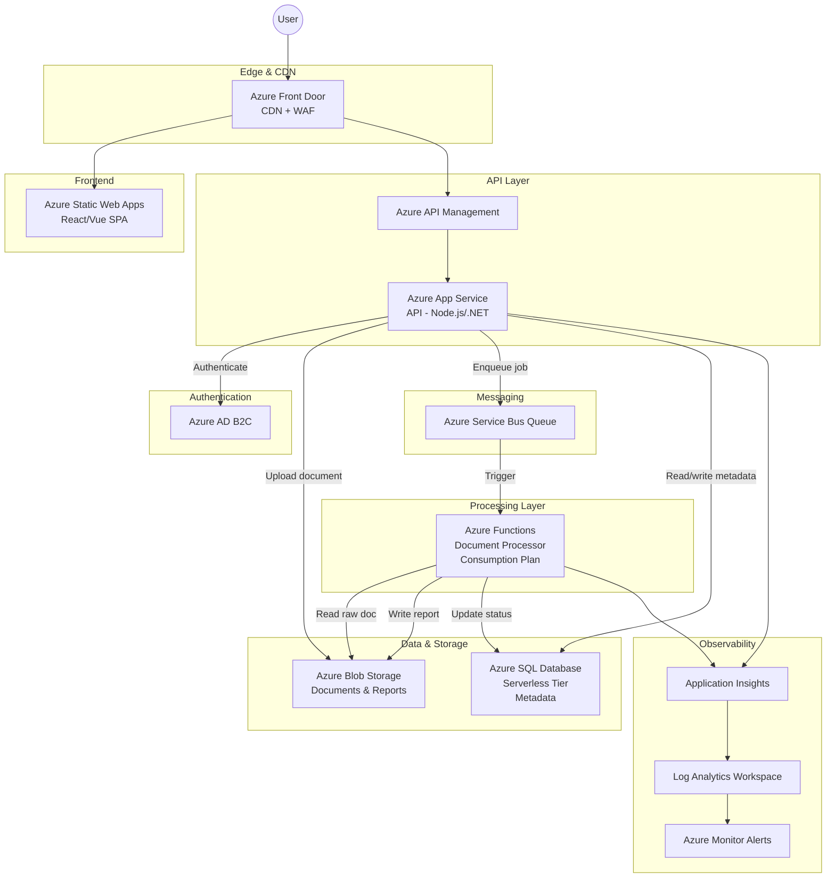

# Modernizing a Monolithic Document Processing Application on Azure

## 1. Problem Summary

A company runs a monolithic web application on a single VM that allows customers to upload documents and view generated reports. The system suffers from downtime during traffic spikes, tightly coupled document processing that degrades user experience, no auto-scaling, limited observability, manual deployments, and a single point of failure. The goal is to design a cloud-native architecture on **Microsoft Azure** that decouples processing, scales elastically, and is practical for a small engineering team to operate.

## 2. Functional Requirements

- Users can upload documents through a web dashboard
- Uploaded documents are processed asynchronously (decoupled from the upload request)
- Processed results (reports) are stored and made available to users
- Users can download processed reports through the dashboard

## 3. Non-Functional Requirements

| Requirement | Target |
|---|---|
| **Availability** | ~99.9% (leveraging Azure SLA-backed services) |
| **Scalability** | Handle thousands of uploads per hour with auto-scaling |
| **Security** | Encryption at rest and in transit, least-privilege access, managed identities |
| **Async Processing** | Document workloads processed via queue-driven workers |
| **Cost Efficiency** | Consumption-based pricing where possible; avoid over-provisioning |
| **Observability** | Centralized logging, monitoring dashboards, and alerting |

## 4. Proposed Architecture

### Architecture Diagram

### Component Breakdown

| Component | Azure Service | Purpose |
|---|---|---|
| **Frontend** | Azure Static Web Apps | Host the SPA dashboard; built-in CI/CD via GitHub Actions, global distribution, free SSL |
| **CDN / Edge** | Azure Front Door | Global load balancing, CDN caching for static assets, Web Application Firewall (WAF) |
| **API Layer** | Azure App Service (B1/S1) + API Management | RESTful API for uploads, metadata, and report retrieval. APIM provides rate limiting, API versioning, and developer portal |
| **Authentication** | Azure AD B2C | Managed identity provider for customer sign-up/sign-in with OAuth 2.0 / OIDC |
| **Messaging** | Azure Service Bus (Standard) | Reliable message queue decoupling uploads from processing; supports dead-letter queues for failed jobs |
| **Processing** | Azure Functions (Consumption Plan) | Event-driven document processing triggered by Service Bus messages; scales to zero when idle |
| **Document Storage** | Azure Blob Storage (Hot/Cool tiers) | Store raw uploads and generated reports; lifecycle policies move old files to Cool tier |
| **Metadata Store** | Azure SQL Database (Serverless) | Store document metadata, processing status, and user data; auto-pauses when idle to save cost |
| **Observability** | Application Insights + Log Analytics + Azure Monitor | Distributed tracing, structured logging, custom dashboards, and alert rules |

## 5. Data Flow

### Upload Flow
1. User authenticates via **Azure AD B2C** and receives a JWT token
2. User selects a document in the **SPA** and submits the upload
3. The **API** (App Service) validates the token and request
4. The API uploads the document to **Azure Blob Storage** and writes a metadata record (status: `pending`) to **Azure SQL**
5. The API publishes a message to the **Azure Service Bus Queue** containing the blob URI and metadata ID
6. The API returns `202 Accepted` with a tracking ID to the user

### Processing Flow
1. **Azure Functions** is triggered by the Service Bus message
2. The function downloads the raw document from **Blob Storage**
3. The function performs document processing (parsing, transformation, report generation)
4. The generated report is written back to **Blob Storage**
5. The metadata record in **Azure SQL** is updated (status: `completed`, report URI)
6. If processing fails, the message moves to the **dead-letter queue** and the status is set to `failed`

### Report Retrieval Flow
1. User opens the dashboard and the **SPA** calls the API to list documents
2. The **API** queries **Azure SQL** for the user's documents and their statuses
3. For completed reports, the API generates a **time-limited SAS URL** for the blob
4. The user downloads the report directly from **Blob Storage** via the SAS URL (offloading bandwidth from the API)

## 6. Key Design Decisions

| Decision | Rationale |
|---|---|
| **Azure Functions (Consumption) for processing** | Scales to zero when idle — critical for cost efficiency at early-stage scale. Scales out automatically during spikes. |
| **Azure Service Bus over Storage Queues** | Provides dead-letter queues, message sessions, and at-least-once delivery guarantees — important for reliable document processing. |
| **Azure SQL Serverless over Cosmos DB** | Relational data model fits document metadata well; serverless tier auto-pauses after inactivity, reducing cost. Cosmos DB would be overkill at early scale. |
| **SAS URLs for downloads** | Offloads download traffic from the API directly to Blob Storage, reducing API compute costs and latency. |
| **Static Web Apps for frontend** | Free tier available, built-in GitHub Actions CI/CD, global CDN, managed SSL — minimal operational overhead for a small team. |
| **API Management** | Provides rate limiting, versioning, and a single entry point even if the API layer evolves into multiple services later. |

## 7. Scalability Approach

- **Frontend**: Azure Static Web Apps + Front Door CDN serve static assets globally with no scaling configuration needed
- **API Layer**: App Service supports horizontal auto-scaling rules based on CPU/request count; can scale from 1 to N instances within minutes
- **Processing Layer**: Azure Functions on the Consumption Plan scales automatically based on queue depth — from 0 to hundreds of instances — handling burst uploads of thousands per hour
- **Database**: Azure SQL Serverless auto-scales compute within a configured vCore range; read replicas can be added if read-heavy queries become a bottleneck
- **Storage**: Azure Blob Storage scales virtually without limit; no capacity planning needed
- **Queue**: Azure Service Bus Standard tier handles thousands of messages per second

This design ensures the **upload path** (API) and **processing path** (Functions) scale independently, so heavy processing never degrades the user-facing experience.

## 8. Security Considerations

| Area | Approach |
|---|---|
| **Authentication** | Azure AD B2C with OAuth 2.0; JWT tokens validated at the API layer |
| **Authorization** | Users can only access their own documents; enforced at the API query level |
| **Encryption at rest** | Azure Blob Storage and Azure SQL use service-managed encryption (AES-256) by default |
| **Encryption in transit** | TLS 1.2+ enforced across all endpoints; Front Door terminates SSL |
| **Secrets management** | Azure Key Vault stores connection strings, API keys; App Service and Functions reference secrets via Key Vault references |
| **Network security** | API Management with IP filtering; Private endpoints for Blob Storage & SQL in production; WAF on Front Door |
| **Identity** | Managed Identities for service-to-service auth (App Service → Blob, SQL, Service Bus) — no credentials in code |
| **Least privilege** | Each service's managed identity is granted only the RBAC roles it needs (e.g., `Storage Blob Data Contributor`, `Service Bus Data Sender`) |

## 9. Operational Considerations

### CI/CD
- **Frontend**: GitHub Actions workflow triggered on push to `main`; deploys to Azure Static Web Apps automatically
- **API**: GitHub Actions builds, tests, and deploys to Azure App Service using deployment slots (blue-green) for zero-downtime releases
- **Functions**: GitHub Actions deploys Azure Functions via `func azure functionapp publish`
- **Infrastructure**: Bicep templates in a `/infra` folder, deployed via a separate pipeline for IaC

### Monitoring & Alerting
- **Application Insights** provides distributed tracing across App Service and Functions, request/dependency tracking, and live metrics
- **Log Analytics Workspace** aggregates all logs for KQL-based querying
- **Azure Monitor Alert Rules**:
  - API error rate > 5% → PagerDuty/email
  - Function execution failures → alert on dead-letter queue depth
  - SQL DTU > 80% → scaling alert
  - Blob Storage throttling → capacity alert

### Deployment Strategy
- **Staging slots** on App Service for pre-production validation
- **Feature flags** for gradual rollout of new processing logic
- **Automated health checks** post-deployment with auto-rollback

## 10. Trade-offs and Alternatives

| Alternative Considered | Why Not Chosen |
|---|---|
| **Azure Kubernetes Service (AKS)** | Powerful but adds significant operational complexity (cluster management, networking, Helm charts). Overkill for a small team at early scale. Can migrate later if needed. |
| **Azure Container Apps** | Good middle ground, but Azure Functions on Consumption Plan offers true scale-to-zero and simpler event-driven scaling for queue processing. |
| **Cosmos DB** | Multi-model, globally distributed — but adds cost and complexity. Relational metadata fits Azure SQL well; the serverless tier matches the cost profile. |
| **Azure Storage Queues** | Simpler and cheaper, but lacks dead-letter queues and advanced features. Service Bus provides better reliability guarantees for document processing. |
| **Azure VM Scale Sets** | Would replicate the monolith pattern. PaaS/serverless services reduce undifferentiated infrastructure management. |
| **Event Grid instead of Service Bus** | Event Grid is excellent for event routing but Service Bus is better suited for reliable work-queue semantics with retry and dead-lettering. |

### Future Evolution Path
As the product grows, the architecture can evolve:
- Move to **Azure Container Apps** if processing requires long-running or GPU-intensive workloads
- Add **Azure Cognitive Services** for AI-powered document analysis
- Introduce **Azure Event Grid** for event-driven notifications (e.g., email user when report is ready)
- Scale to multiple regions with **Azure Front Door** multi-origin routing and **Cosmos DB** for global metadata replication
