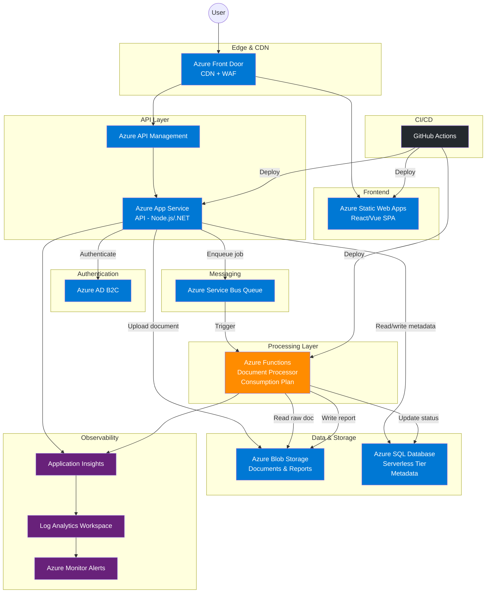
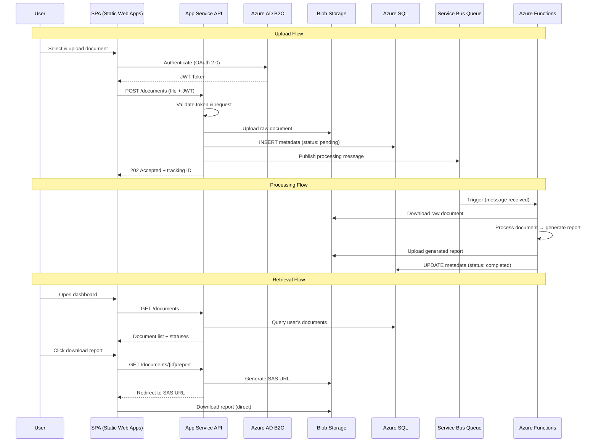

```mermaid
graph TB
    subgraph "Edge & CDN"
        AFD[Azure Front Door<br/>CDN + WAF]
    end

    subgraph "Frontend"
        SWA[Azure Static Web Apps<br/>React/Vue SPA]
    end

    subgraph "API Layer"
        APIM[Azure API Management]
        APP[Azure App Service<br/>API - Node.js/.NET]
    end

    subgraph "Authentication"
        AAD[Azure AD B2C]
    end

    subgraph "Messaging"
        SBQ[Azure Service Bus Queue]
    end

    subgraph "Processing Layer"
        FUNC[Azure Functions<br/>Document Processor<br/>Consumption Plan]
    end

    subgraph "Data & Storage"
        BLOB[Azure Blob Storage<br/>Documents & Reports]
        SQL[Azure SQL Database<br/>Serverless Tier<br/>Metadata]
    end

    subgraph "Observability"
        AI[Application Insights]
        LOG[Log Analytics Workspace]
        MON[Azure Monitor Alerts]
    end

    subgraph "CI/CD"
        GH[GitHub Actions]
    end

    User((User)) --> AFD
    AFD --> SWA
    AFD --> APIM
    APIM --> APP
    APP -- "Authenticate" --> AAD
    APP -- "Upload document" --> BLOB
    APP -- "Enqueue job" --> SBQ
    APP -- "Read/write metadata" --> SQL
    SBQ -- "Trigger" --> FUNC
    FUNC -- "Read raw doc" --> BLOB
    FUNC -- "Write report" --> BLOB
    FUNC -- "Update status" --> SQL
    APP --> AI
    FUNC --> AI
    AI --> LOG
    LOG --> MON
    GH -- "Deploy" --> SWA
    GH -- "Deploy" --> APP
    GH -- "Deploy" --> FUNC

    style AFD fill:#0078d4,color:#fff
    style SWA fill:#0078d4,color:#fff
    style APIM fill:#0078d4,color:#fff
    style APP fill:#0078d4,color:#fff
    style AAD fill:#0078d4,color:#fff
    style SBQ fill:#0078d4,color:#fff
    style FUNC fill:#ff8c00,color:#fff
    style BLOB fill:#0078d4,color:#fff
    style SQL fill:#0078d4,color:#fff
    style AI fill:#68217a,color:#fff
    style LOG fill:#68217a,color:#fff
    style MON fill:#68217a,color:#fff
    style GH fill:#24292e,color:#fff
```

## Data Flow Diagram

```mermaid
sequenceDiagram
    participant U as User
    participant FE as SPA (Static Web Apps)
    participant API as App Service API
    participant AUTH as Azure AD B2C
    participant BLOB as Blob Storage
    participant DB as Azure SQL
    participant Q as Service Bus Queue
    participant FN as Azure Functions

    Note over U,FN: Upload Flow
    U->>FE: Select & upload document
    FE->>AUTH: Authenticate (OAuth 2.0)
    AUTH-->>FE: JWT Token
    FE->>API: POST /documents (file + JWT)
    API->>API: Validate token & request
    API->>BLOB: Upload raw document
    API->>DB: INSERT metadata (status: pending)
    API->>Q: Publish processing message
    API-->>FE: 202 Accepted + tracking ID

    Note over U,FN: Processing Flow
    Q->>FN: Trigger (message received)
    FN->>BLOB: Download raw document
    FN->>FN: Process document → generate report
    FN->>BLOB: Upload generated report
    FN->>DB: UPDATE metadata (status: completed)

    Note over U,FN: Retrieval Flow
    U->>FE: Open dashboard
    FE->>API: GET /documents
    API->>DB: Query user's documents
    API-->>FE: Document list + statuses
    U->>FE: Click download report
    FE->>API: GET /documents/{id}/report
    API->>BLOB: Generate SAS URL
    API-->>FE: Redirect to SAS URL
    FE->>BLOB: Download report (direct)
```
